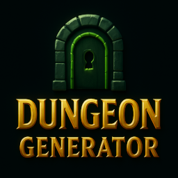
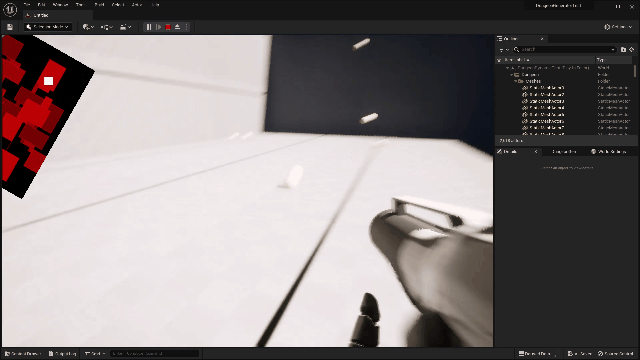
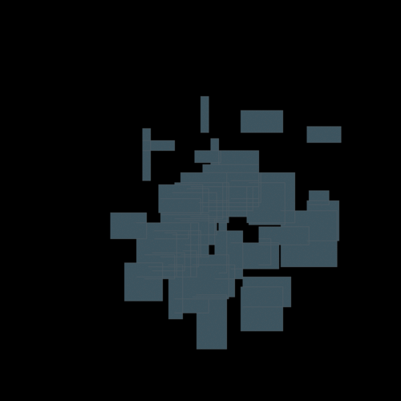

<h1>Dungeon generator plugin for Unreal Engine 5</h1>

Please visit our website for full feature list: [https://happy-game-dev.undo.jp/](https://happy-game-dev.undo.jp/plugins/DungeonGenerator/index.html)

# 🚩 Table of Contents
- [Endless Adventures, Instantly Generated](#-endless-adventures-instantly-generated)
- [Features](#-features)
- [Requirements](#-requirements)
- [License](#-license)
- [See also](#-see-also)
- [Author](#-authors)

# 👾 Endless Adventures, Instantly Generated
Bring your roguelike and hack-and-slash games to life with next-level dungeon generation.
Whether you’re aiming for fast-paced, loot-filled battles or deep exploration with infinite replayability,
this Unreal Engine plugin gives you the power to craft unique dungeons every time.

With just a few parameters—such as grid scale, number of rooms, and your own generation rules—you can instantly produce fully playable layouts. The system works seamlessly both in-editor and at runtime, and is available in both C++ and Blueprint, giving you the flexibility to integrate it into any workflow.

## Visualization of dungeon generation status
The dungeon generator was based on Vazgriz's algorithm. You can read more about [Vazgriz's algorithm here](https://vazgriz.com/119/procedurally-generated-dungeons/).

To vazgriz,
The foundational generation algorithm you shared was a major source of inspiration and became the starting point for my development of the DungeonGenerator plugin. Without your ideas, I don't think I would have arrived at its current form. I'm truly grateful for the knowledge you made available and the impact it had on my work.

# 🎨 Features
* DungeonGenerator is a plug-in for UnrealEngine5.
* Tiled Dungeon Generation both In-Editor & Runtime.
* Users can easily generate dungeons by preparing meshes for floors, walls, ceilings, and stairs.
* Supports dungeon replication
* Generates actors for doors and keys by MissionGraph.
* The following features are supported only in the [Fab](https://fab.com/s/f5587c55bad0) version
  * Sub-levels can be applied as dungeon rooms
  * A mini-map of the dungeon can be generated.
  * Interior decoration. [beta version]
  * Foliage decoration. [beta version]
* Supported Development Platforms: Windows,Android,Linux
* Supported Target Build Platforms: Windows,Android,Linux (should be possible to target all platforms)

# 🔧 Requirements
* [Unreal Engine 5.1 ~ Unreal Engine 5.6](https://www.unrealengine.com/)
* [Visual Studio 2022](https://visualstudio.microsoft.com/)

# 📜 License
This demo is licensed under the MIT license; check the DungeonGenerator plugin, which is licensed under a different license.
The Fab version is licensed under the Epic Standard License, and the free trial version is licensed under GPL version 3.

# 👀 See also
* [Issues](https://github.com/shun126/UE5-DungeonGeneratorDemo/issues)
* [Discussions](https://github.com/shun126/UE5-DungeonGeneratorDemo/discussions)
* [Wiki](https://github.com/shun126/UE5-DungeonGeneratorDemo/wiki)
* [DeepWiki](https://deepwiki.com/shun126/DungeonGenerator)
* [Doxygen](https://happy-game-dev.undo.jp/_doxygen/dungeon_generator/index.html)
* Trailer video: [YouTube](https://youtu.be/1igd4pls5x8)
* Tutorial videos: [YouTube](https://www.youtube.com/playlist?list=PLlMDkSa8bQnK4PDIfkXYorQIucn47ifKO)
* You can download [the free trial version](https://github.com/shun126/DungeonGenerator).

The [Fab](https://fab.com/s/f5587c55bad0) version includes the following enhancements.
* Sub-levels can be applied as dungeon rooms
* A mini-map of the dungeon can be generated.
* Interior decoration. [beta version]
* Foriage decoration. [beta version]

Please visit our website for full feature list: [https://happy-game-dev.undo.jp/](https://happy-game-dev.undo.jp/plugins/DungeonGenerator/index.html)

# 👾 Authors
* Shun Moriya ([X.com](https://x.com/monjiro1972))
* Nonbiri ([X.com](https://x.com/happy_game_dev) / [YouTube](https://www.youtube.com/channel/UCkLXe57GpUyaOoj2ycREU1Q))

